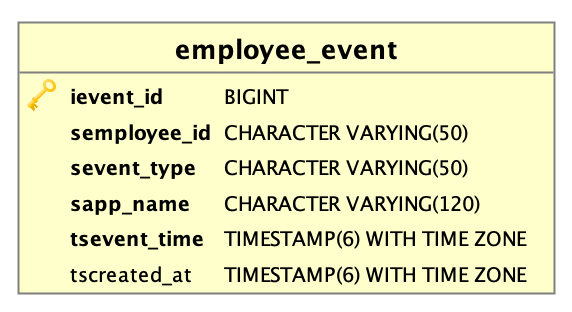

## Event Service API

 - The event service is responsible for listening to the events generated by employee-service and saving them in its own database. 
 - This service provides REST endpoint for fetching event details in ascending order for the specific Employee and the result will be in JSON array format. 

### Data Model



- *Description*
    - `ievent_id` - This field stores the auto generated value and this is primary of the table.
    - `semployee_id` - The identifier of the employee. (UUID)
    - `sevent_type` - This field stores the type of the event. Example values: CREATED, UPDATED and DELETED
    - `sapp_name` - The application name which generated the event. Example: employee-service
    - `tsevent_time` - The timestamp when the event was created at producer end.
    - `tscreated_at` - The timestamp when the data created in table.

### Setup Local Environment

- *Please refer `README.md` in "bob-challenge-employee-service" project for the details*
    
## Build

- You can build the project below command,

```bash
mvn clean install

# In case, you want to skip executing the tests,

mvn clean install -DskipTests
```

**Note:** You will see compilation errors when you open the projects for the very first time, that is because of `Auto generated` classes and the errors will disappear after building the project.  

## Run as Docker Container

- Build the docker image in local by executing the below command from project folder,

```bash
docker build . --tag=takeaway/bob-challenge-event-service:1.0.0

# Please execute the below command when you want to push the image to docker registry

docker push takeaway/bob-challenge-event-service:1.0.0
```

- Verify the docker image by executing `docker image ls`
- Execute command: `docker-compose up -d` which will create docker container with name: `event-service`
- Please visit [Swagger-UI](http://localhost:8090/takeaway/swagger-ui/index.html) for knowing more about Event Service APIs. 

## Run in Local (In command line)

- Execute the below command after building the project successfully

```bash
java -jar -Dlogging.config=classpath:logback-local.xml -Dspring.profiles.active=local bob-challenge-event-service-1.0.0.jar
```
- Please visit [Swagger-UI](http://localhost:8090/takeaway/swagger-ui/index.html) for knowing more about Event Service APIs. 

## Database Migration

- The database migration is a automatic process which happens during the application start up. It will create all necessary objects required by the application.
- The migration is done by `Flyway Tool` which is a open source database-migration tool.
- The database migration scripts are maintained in folder: `src/main/resources/db/migration`.
- Flyway creates table `flyway_schema_history` in "public" schema for versioning and storing the history of execution.

## Other Information

- In case you want to **recreate the database**, then simply delete all data from folders: `local/db/data` & `local/pgadmin-data` and execute `docker-compose up -d`
- In case you want to **view Kafka Messages**, then please visit to [Kafdrop-UI](http://localhost:9100)
    - Click on topic name: `takeway_employee_updates` under "Topics" section
    - Click on "View Messages" -> Select key format as "AVRO" and value format as "AVRO" then submit "View Messages"
    - Please change the "Partition" number if in case you want to see particular partition messages.